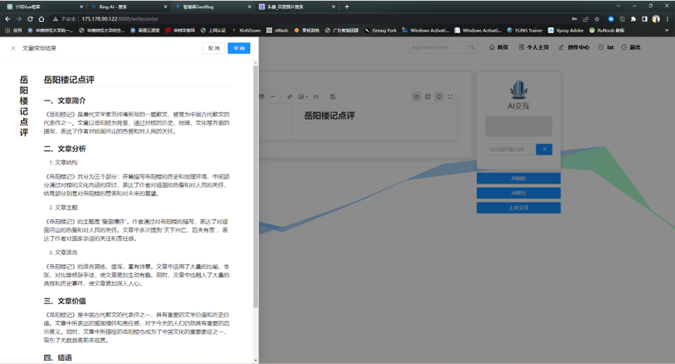
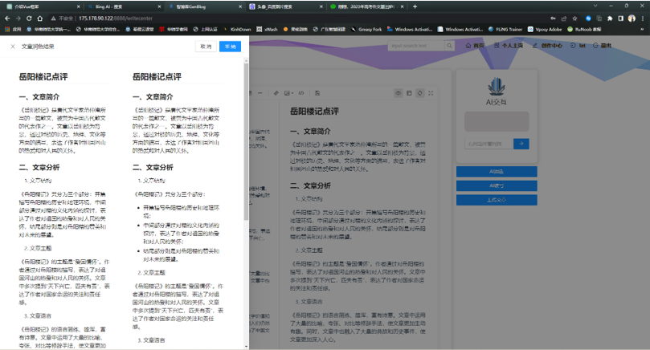
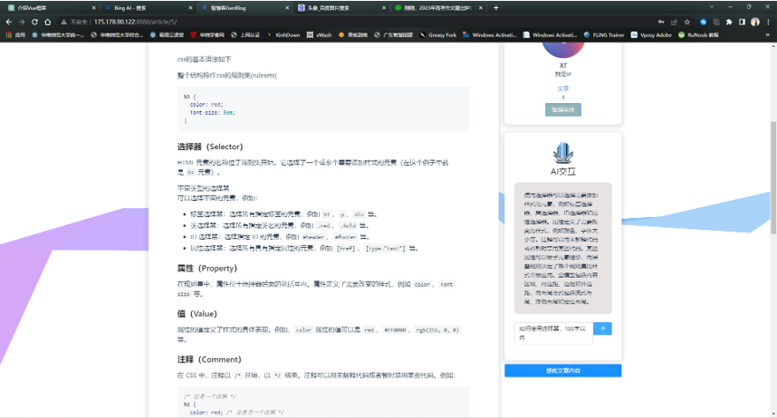
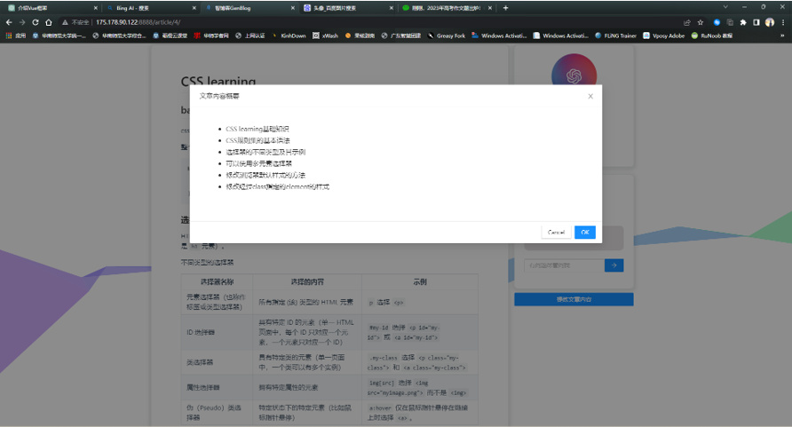

  
  <h1 align="center">GenBlog Smart Blog</h1>

## Introduction

**GenBlog** is an innovative and interactive smart blogging platform powered by the latest **GPT API** technology. We are dedicated to integrating AI technology to make blogging, reading, and interaction more intelligent and personalized, thereby creating an unprecedented blogging experience for users.

## Tech Stack

- **Frontend**: Utilizes the modern JavaScript framework VUE, combined with the Ant Design component library, to create an interface that is both beautiful and easy to use.

- **Backend**: Employs the Django framework, ensuring high performance of the platform as well as the security and stability of data processing.

- **AI Features**: The core functionalities are supported by the GPT3.5 API, enhancing the intelligence of our smart modules for writing and reading.

## Key Features

- **User Module**: GenBlog offers a comprehensive user management function, including user registration, login, following other users, and editing personal profiles, allowing users to communicate and share in a friendly and secure environment.

- **Article Module**: Users can easily create, modify, and delete articles on the platform. We also provide a powerful article search function to help users quickly find the content they are interested in.

- **AI Module**: One of the highlights of GenBlog is its integrated AI functionalities, thanks to the powerful support of the GPT3.5 API. Utilizing GPT, **we offer users a series of AI-enhanced features, including article summarization, article continuation, article polishing, and Q&A based on article content**, aimed at improving the writing efficiency and reading experience of users.

### AI Module: Continuation

### AI Module: Polishing

### AI Module: Q&A

### AI Module: Summary

## Quick Start
Starting your journey with GenBlog Smart Blog is incredibly simple, just follow these steps:

### Step One: Configure the Backend

1. **Obtain API Key**: Ensure you have a valid API key, which is crucial for connecting and utilizing the GPT API.
2. **Configure Proxy**: If needed by your network environment, set up the appropriate proxy to ensure the backend service can access the GPT API without issues.
3. **Launch Django Backend**: With your API key, start the Django backend program, making sure all dependencies are installed and configured correctly.

### Step Two: Configure the Frontend

1. **Modify Frontend Configuration**: Point the frontend code's API endpoint to your Django backend service.
2. **Launch Vue Application**: Ensure all frontend dependencies are correctly installed, then launch the Vue application. At this point, you should be able to see the GenBlog interface and start exploring the various functionalities of the smart blog.

Following these steps will allow you to smoothly start GenBlog Smart Blog and begin your creation and reading journey.

## Acknowledgements
- [VUE](https://github.com/vuejs/vue) : Frontend framework
- [Ant Design](https://github.com/vueComponent/ant-design-vue) : Frontend components
- [Django](https://github.com/django/django) : Backend framework
- [openai-api](https://openai.com/blog/openai-api) : Supports AI features
- [midjourney](https://www.midjourney.com/) : Website logo generated using their technology
