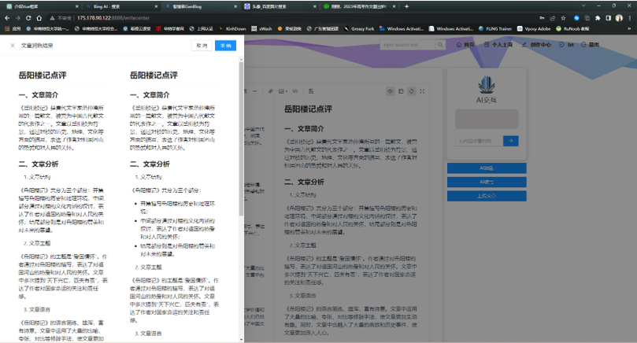
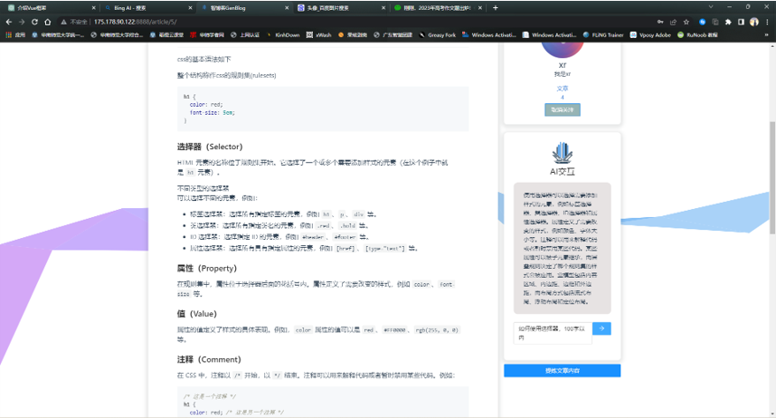
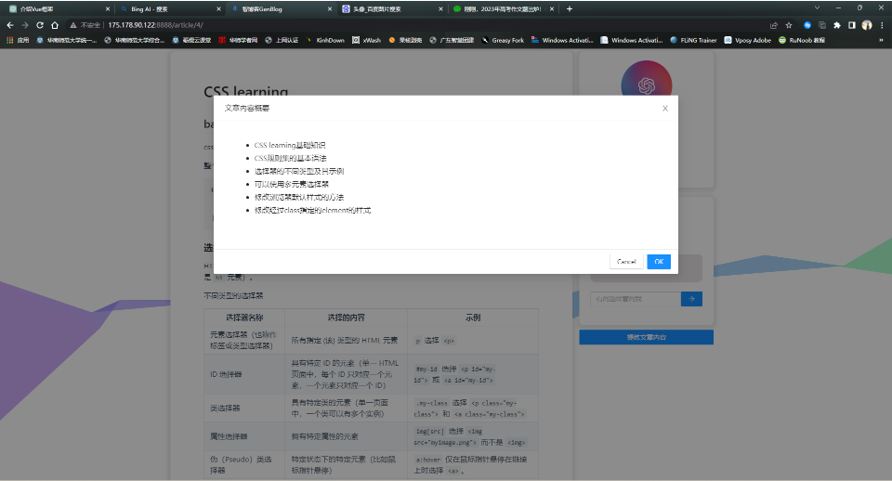

  
  <h1 align="center">GenBlog 智博客</h1>

## 简介

**GenBlog 智博客**是一个结合了最新的GPT API技术，为用户提供富有创新和互动性的智能博客平台。我们致力于通过AI技术的融合，让博客写作、阅读及互动更加智能化、个性化，从而为用户创造出前所未有的博客体验。

## 技术栈

- **前端**: 使用了现代化的JavaScript框架VUE，结合Ant Design组件库，打造出了一个既美观又易用的用户界面。

- **后端**: 采用了Django框架，不仅保证了平台的高性能，也保障了数据处理的安全性和稳定性。

- **AI功能**: 核心功能由GPT3.5 API提供支持，它为我们的智能模块赋能，使得文章写作和阅读更加智能化。

## 功能特色

- **用户模块**: GenBlog提供了一套完整的用户管理功能，包括用户注册、登录、关注其他用户和编辑个人资料等，让用户能够在一个友好和安全的环境中交流和分享。

- **文章模块**: 用户可以轻松地在平台上创建、修改和删除文章。我们还提供了强大的文章搜索功能，帮助用户快速找到他们感兴趣的内容。

- **AI模块**: GenBlog的亮点之一是其集成的AI功能，这得益于GPT3.5 API的强大支持，利用GPT，我们为用户提供了一系列的AI增强功能，包括文章摘要总结、文章续写、文章润色和基于文章内容的问答，旨在提高用户的写作效率和阅读体验。

### AI模块:续写

### AI模块:润色

### AI模块:问答

### AI模块:总结

## 快速开始
开始使用GenBlog智博客的旅程非常简单，仅需遵循以下几个步骤：

### 步骤一：配置后端

1. **获取API密钥**：确保你有一个有效的API密钥，这是连接并使用GPT API的关键。
2. **配置代理**：如果你的网络环境需要，配置适当的代理以确保后端服务能够无障碍访问GPT API。
3. **启动Django后端**：利用你的API密钥启动后端Django程序，确保所有的依赖项都已安装并且配置正确。

### 步骤二：配置前端

1. **修改前端配置**：将前端代码中的API端点指向你的Django后端服务。
2. **启动Vue应用**：确保所有前端依赖都已正确安装，然后启动Vue应用。此时，你应该可以看到GenBlog的界面，并开始探索智能博客的各项功能。

遵循上述步骤后，你将能够顺利启动GenBlog智博客，开始你的创作和阅读之旅。

## 致谢
- [VUE](https://github.com/vuejs/vue) : 前端框架
- [Ant Design](https://github.com/vueComponent/ant-design-vue) : 前端组件
- [Django](https://github.com/django/django) : 后端框架
- [openai-api](https://openai.com/blog/openai-api) : 支持AI功能
- [midjouney](https://www.midjourney.com/) : 网站logo利用其生成
